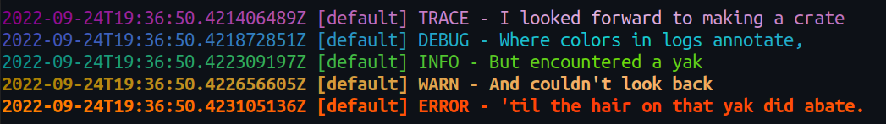

# disco

Log like it's 1978 with this logging implementation for the [log](https://crates.io/crates/log) crate. Color themes, pluggable formatting, we've got it all!


# Installation

Add the following to `Cargo.toml`:

```toml
[dependencies]
disco = "0.1"
log = "0.4"
```

# Quick start

Create and initialize a `DiscoLogger`, then use the [log](https://crates.io/crates/log) crate macros to log messages:

```rust
use disco::DiscoLogger;

fn main() {
    // setup logger
    DiscoLogger::new().init().unwrap();

    // log away!
    log::trace!("foo");
    log::debug!("bar");
    log::info!("baz");
    log::warn!("spam");
    log::error!("eggs");
}
```

Note that the default `DiscoLogger` created with `::new()` has a log level filter of `info`, so in this example, only `"baz"` `"spam"` and `"eggs"` will be printed to the console.

# Logger config options

For more control, `DiscoLogger`s can be created with a `Config` struct via `DiscoLogger::with_config`:

```rust
use disco::{Config, DiscoLogger};
use log::LevelFilter;

fn main() {
    let config = Config {
        level: LevelFilter::Trace,
        ...Default::default()
    };

    DiscoLogger::with_config(config).init().unwrap();
}
```

The default configuration uses the following settings:

```rust
Config {
    level: LevelFilter::Info,
    record_format: RecordFormat::Simple,
    color_format: Some(ColorFormat::Solid),
    theme: Box::new(theme::Simple {}),
    use_stderr: true,
}
```

Each setting is explained in its own subsection:

- [level](#level)
- [record_format](#record_format)
- [color_format](#color_format)
- [theme](#theme)
- [use_stderr](#use_stderr)

## level

The `level` setting controls which log records are processed and which are ignored. The `LevelFilter` enum used in `Config` is taken directly
from [the log crate](https://docs.rs/log/latest/log/enum.LevelFilter.html). It defines the following variants:

- `Off`
- `Trace`
- `Debug`
- `Info`
- `Warn`
- `Error`

Only records logged at or above the chosen severity will be output to `stdout`/`stderr`. For example:

```rust
// --snip--

let config = Config {
    level: LevelFilter::Info,
    ...Default::default()
};

// --snip--

// trace and debug logs will be ignored, only info, warn, and error messages will print to the screen
log::trace!("foo");
log::debug!("bar");
log::info!("baz");
log::warn!("spam");
log::error!("eggs");
```

## record_format

The `record_format` setting controls how log records are (structurally) formatted when they are displayed. Each call to the [log](https://docs.rs/log/latest/log/)
crate macros (`trace!`, `info!`, etc...) generates a log [record](https://docs.rs/log/latest/log/struct.Record.html). These records are then formatted by this crate using one
of the variants in the `RecordFormat` enum:

- `Json`
- `Simple`
- `Custom`

Record formats are imported and used by:

```rust
use disco::{Config, DiscoLogger, RecordFormat};
use log::LevelFilter;

fn main() {
    let config = Config {
        level: LevelFilter::Trace,
        record_format: RecordFormat::Simple,
        ..Default::default()
    };
    DiscoLogger::with_config(config).init().unwrap();
}
```

### Simple format

This is the default record format and will generate log lines that look like this:

```text
2022-07-31T20:25:31.108560826Z [main] TRACE - foo
2022-07-31T20:25:31.108623041Z [main] DEBUG - bar
2022-07-31T20:25:31.108645580Z [main] INFO - baz
2022-07-31T20:25:31.108667634Z [main] WARN - spam
2022-07-31T20:25:31.108736790Z [main] ERROR - eggs
```

Note that times are always in ISO 8601 format, UTC time.

### Json format

This record format will generate log lines as JSON:

```json
{"time":"2022-07-31T20:28:11.863634602Z","level":"TRACE","target":"main","message":"foo"}
{"time":"2022-07-31T20:28:11.864114090Z","level":"DEBUG","target":"main","message":"bar"}
{"time":"2022-07-31T20:28:11.864201937Z","level":"INFO","target":"main","message":"baz"}
{"time":"2022-07-31T20:28:11.864269093Z","level":"WARN","target":"main","message":"spam"}
{"time":"2022-07-31T20:28:11.864372619Z","level":"ERROR","target":"main","message":"eggs"}
```

Note that times are always in ISO 8601 format, UTC time.

### Custom format

If you don't like any of the above formats, you can inject your own custom record formatting by using the `Custom` format:

```rust
use disco::{Config, DiscoLogger, RecordFormat};
use log::{LevelFilter, Record};

fn main() {
    let fmt_rec = Box::new(|r: &Record| -> String {
        format!("{} - {}", r.level(), r.args())
    });

    let config = Config {
        level: LevelFilter::Trace,
        record_format: RecordFormat::Custom(fmt_rec),
        ..Default::default()
    };
    DiscoLogger::with_config(config).init().unwrap();

    // log away!
    log::trace!("foo");
    log::debug!("bar");
    log::info!("baz");
    log::warn!("spam");
    log::error!("eggs");
}
```

The above example format will generate log lines that look like this:

```text
TRACE - foo
DEBUG - bar
INFO - baz
WARN - spam
ERROR - eggs
```

See [the log crate "Record" struct](https://docs.rs/log/latest/log/struct.Record.html) for available record fields/methods to use within the custom format closure.

For reference, the `Simple` record format can be reproduced with the following `Custom` record format:

```rust
use time::format_description::well_known::Iso8601;
use time::OffsetDateTime;

// --snip--

let fmt_rec = Box::new(|r: &Record| -> String {
    let now = OffsetDateTime::now_utc()
        .format(&Iso8601::DEFAULT)
        .expect("Failed to format time as ISO 8601");

    format!("{} [{}] {} - {}", now, r.target(), r.level(), r.args())
});
```

## color_format

The `color_format` setting controls how log records are colored (specifically how a theme is applied) when they are displayed. Log records are formatted by this crate using one of the variants in the `ColorFormat` enum, or `None`:

- `Solid`
- `InlineGradient(<steps>)`
- `MultiLineGradient(<steps>)`

Color formats are imported and used by:

```rust
use disco::{Config, DiscoLogger, ColorFormat};
use log::LevelFilter;

fn main() {
    let config = Config {
        level: LevelFilter::Trace,
        color_format: Some(ColorFormat::Solid),
        ..Default::default()
    };
    DiscoLogger::with_config(config).init().unwrap();
}
```

### None format

If `None` is provided as the `color_format`, log records will not be colored (warnings and errors will still be made bold).

### Solid format

This will generate log lines that each have a solid color, determined by log level.  The below screenshot uses the `Spectral` theme and the following color format:
```rust
color_format: Some(ColorFormat::Solid)
```


### Inline gradient format

This will generate log lines that are colored with a repeating linear gradient from left to right, determined by log level.  The below screenshot uses the `Spectral` theme and the following color format:
```rust
color_format: Some(ColorFormat::InlineGradient(60))
```


This color format takes a `usize` argument which represents the number of steps required to go from the start color to the end color for each level's color gradient.  Gradients will be traversed in alternating ascending and descending order.  In the above example, it will take `60` characters to go from the starting color for each line to the ending color, then `60` more characters to return to the starting color again.

Note that this color format will incur a nontrivial performance hit with heavy logging.  If you have a lot of logs and are trying to break the next land speed record for fastest program, you probably shouldn't use this color format.

### Multi-line gradient format

This will generate log lines that each have a solid color, determined by level.  Lines within each level will change color step by step, moving through a linear gradient of colors determined by the relevant log level.  The below screenshot uses the `Spectral` theme and the following color format:
```rust
color_format: Some(ColorFormat::MultiLineGradient(30))
```


This color format takes a `usize` argument which represents the number of steps required to go from the start color to the end color for each level's color gradient.  Gradients will be traversed in alternating ascending and descending order.  In the above example, it will take `30` lines to go from the starting color for each level to the ending color, then `30` more lines to return to the starting color again.

## theme

TODO

## use_stderr

The `use_stderr` determines if log records are split between `stdout` and `stderr` or not. When this field is false, all log records will be written to `stdout`. When this field is true, records at levels `trace`, `debug`, and `info` are written to `stdout`, while those at `warn` and `error` levels are written to `stderr`.

# Examples

See the `examples` directory for a variety of usage examples.  You can run any of these examples with:
```shell
$ cargo run --example <example name>
```

# Stream redirection tips in Linux

When logging with `use_stderr` set to true, you must redirect both streams to capture all output.

To redirect all log records to file:

```shell
$ ./example &> foo.log
```

To redirect all logs to file, while watching output:
Write all log data to `foo.log` and stdout:

```shell
$ ./example 2>&1 | tee foo.log
```

You can add `jq` for pretty printing:

```shell
$ ./example 2>&1 | tee foo.log | jq
```
